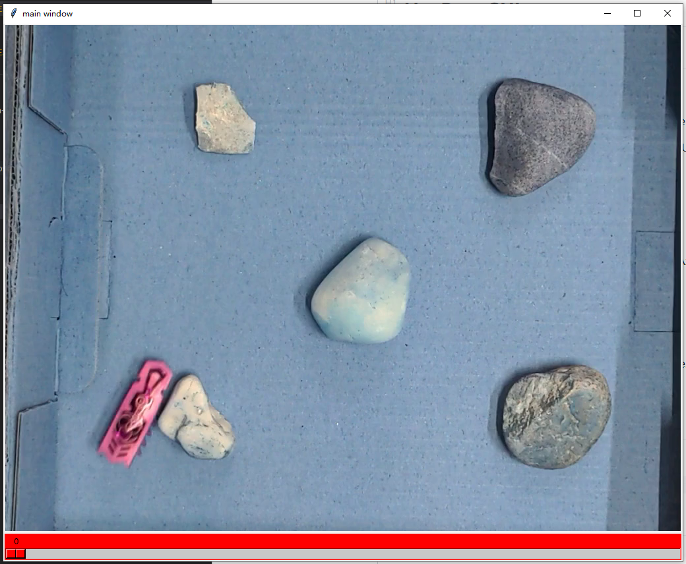
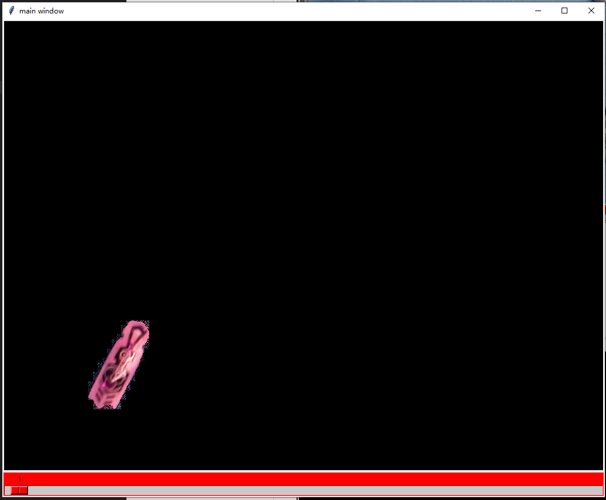
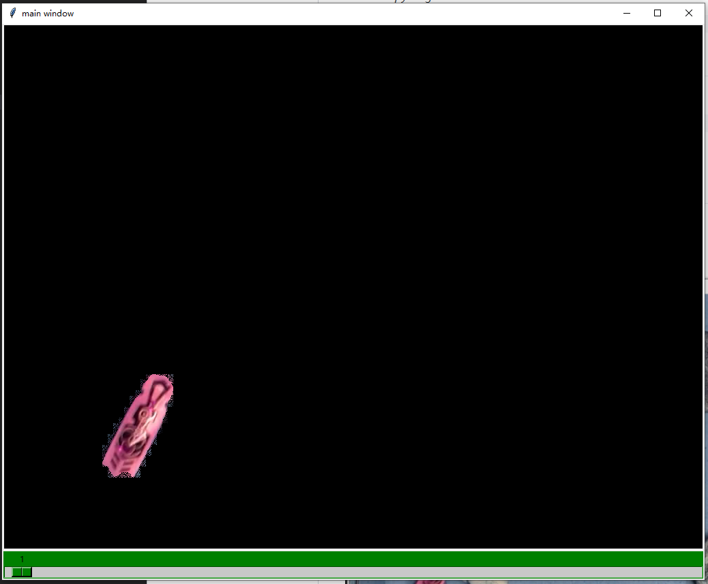

# HexBug_GUI

## 1. Download the data

### 1.1. Download Annotations

You can download it from studon the Seminar webpage or the link below.

https://drive.google.com/file/d/1EGRYuSSB08AJ0PARTfUeSH5P885UdxSw/view?usp=sharing

Put it in to folder *Annotation*

### 1.2. Download mask

You can download in the link below.

https://drive.google.com/drive/folders/145sQGKOpDPAzwg58lj1iC7aNFaRGV5y

Put it in to folder *mask-OF*
**Do not change the hierarchy!**

### 1.3. Download train video

You can download it from studon the Seminar webpage.

Put it in to folder *Training videos*

## 2. Prepare the data

run *reset.py* to generate the *.sr* file.

```
python reset.py
```

## 3. Run

Then you can start the GUI by:

```
python run.py
```

you can change the *n_video* to choose run which video (default is 1)

## 4. Instructions

### 4.1 initial interface

When you successfully run the GUI. You should see such a window.



**Please remember how many hexBug do we have in this video**

### 4.2 Shot cut

Use **<-**, **->** on the keyboard to go to the prev or next frame.

Use **A**,**Z** Indicates whether to accept the mask




if you accept the mask the scale should change to green:




When you finish all the frames.

**Close the GUI by click the X on the upper right corner**

Then you just change the *n_video* in run.py. Go to the next video.


